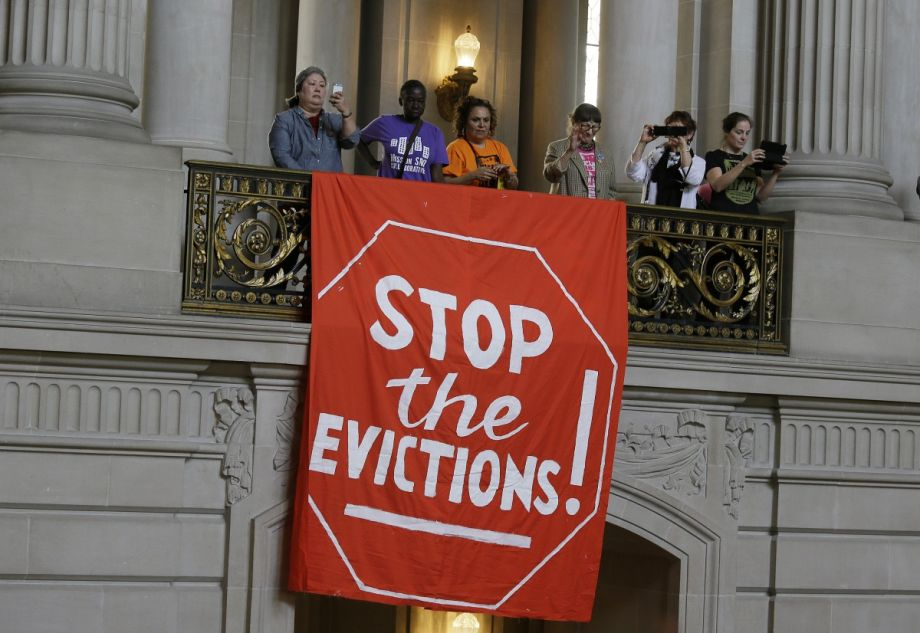

&nbsp;
&nbsp;

*Image from [_Next City_: "The U.S. Metros Hit Hardest by Rising Eviction Rates"](https://nextcity.org/daily/entry/report-eviction-rates-housing-affordability)*

## Evictions and Policy

Lorem ipsum dolor sit amet, consectetur adipiscing elit, sed do eiusmod tempor incididunt ut labore et dolore magna aliqua. Ut enim ad minim veniam, quis nostrud exercitation ullamco laboris nisi ut aliquip ex ea commodo consequat. Duis aute irure dolor in reprehenderit in voluptate velit esse cillum dolore eu fugiat nulla pariatur. Excepteur sint occaecat cupidatat non proident, sunt in culpa qui officia deserunt mollit anim id est laborum.

[illustrative figure?]

Lorem ipsum dolor sit amet, consectetur adipiscing elit, sed do eiusmod tempor incididunt ut labore et dolore magna aliqua. Ut enim ad minim veniam, quis nostrud exercitation ullamco laboris nisi ut aliquip ex ea commodo consequat. Duis aute irure dolor in reprehenderit in voluptate velit esse cillum dolore eu fugiat nulla pariatur. Excepteur sint occaecat cupidatat non proident, sunt in culpa qui officia deserunt mollit anim id est laborum.

## Conclusions

Lorem ipsum dolor sit amet, consectetur adipiscing elit, sed do eiusmod tempor incididunt ut labore et dolore magna aliqua. Ut enim ad minim veniam, quis nostrud exercitation ullamco laboris nisi ut aliquip ex ea commodo consequat. Duis aute irure dolor in reprehenderit in voluptate velit esse cillum dolore eu fugiat nulla pariatur. Excepteur sint occaecat cupidatat non proident, sunt in culpa qui officia deserunt mollit anim id est laborum.

## Sources and Further Reading

1. "Forced Out." *The New Yorker*, January 31, 2016. [Link.](https://www.newyorker.com/magazine/2016/02/08/forced-out)
2. "The Gentrification of Gotham." *CityLab*, April 28, 2017. [Link.](https://www.citylab.com/life/2017/04/the-gentrification-of-gotham/524694/)
3. "It’s Manhattan’s Last Affordable Neighborhood. But for How Long?" *The New York Times*, September 27, 2019. [Link.](https://www.nytimes.com/2019/09/27/nyregion/inwood-manhattan-affordable-housing.html)
4. "The Violence of Eviction." *Dissent Magazine*, Summer 2016. [Link.](https://www.dissentmagazine.org/article/the-violence-of-eviction-housing-market-foreclosure-gentrification-finance-capital)
5. The Eviction Lab: Unpacking America's eviction crisis. [Link.](https://evictionlab.org/)
6. Interactive Map: NYC Eviction Hotspots, 2013-2015. *JustFixNYC*. [Link.](https://justfixnyc.carto.com/builder/2332dd67-c204-4862-bf2f-579a886c65ca/embed)