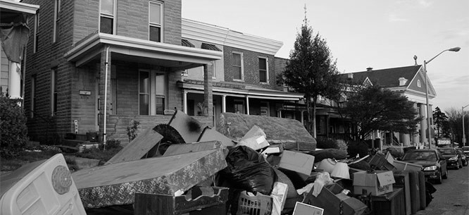

&nbsp;
&nbsp;

*Image from [_Dissent Magazine_: "The Violence of Eviction"](https://www.dissentmagazine.org/article/the-violence-of-eviction-housing-market-foreclosure-gentrification-finance-capital)*

*Scroll Down*

## Background

As Mike Konczal writes in the article above, "To understand how the [U.S.] housing market really works, we need to hear the stories of those who have been pushed out." Evictions represent a major source of housing instability in the U.S., especially in vulnerable communities. Once a rare phenomenon, eviction has now grown to what many consider "epidemic" proportions, with [over 450,000](https://ny.curbed.com/2017/9/25/16361572/rent-stabilization-map-crown-heights-bushwick) evictions filed in New York City between 2013 and 2015.  

Governments and residents have grown accustomed to this. Entire police units, moving companies, and economic infrastructures have been built upon this, as reported by the [*New Yorker*](https://www.newyorker.com/magazine/2016/02/08/forced-out). What factors put individuals, communities, and populations most at-risk for eviction? Who bears the cumulative social and economic consequences of a practice now accepted as commonplace, justified, and even beneficial?
